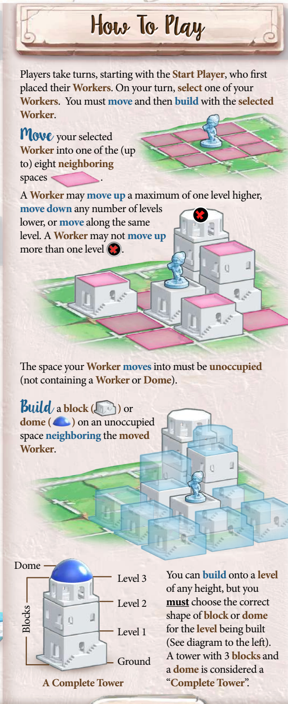
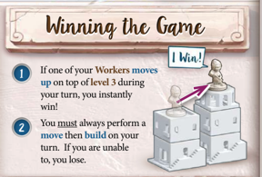
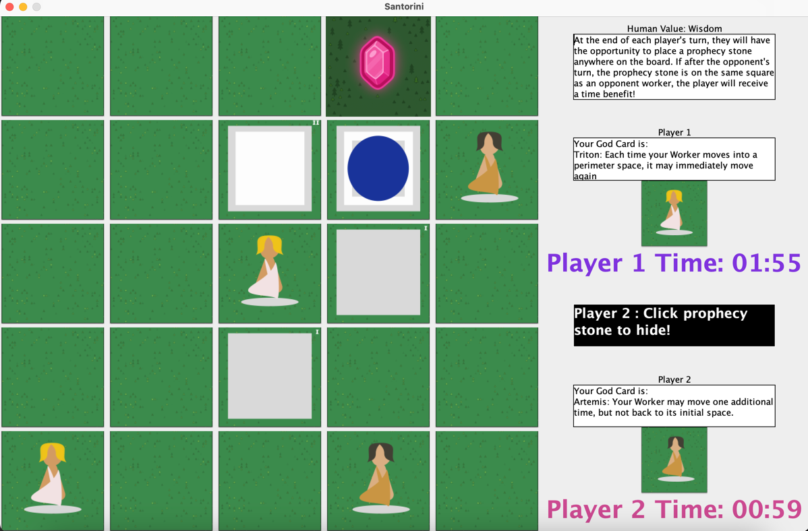

# Santorini-Board-Game
A santorini inspired board game with additional challenges!

Move and build your way to victory in this game of strategy.

Built the base game with 3 lovely teammates, additional features were implemented myself.

## Rules
This virtual implementation of the game follows these original rules:

Each player is randomly assigned a 'God Power':
1. Demeter - Your Build: Your Worker may
build one additional time, but not
on the same space. 
2. Artemis - Your Move: Your Worker may
  move one additional time, but not
  back to its initial space.
3. Triton - Each time your Worker moves into a perimeter space, it may immediately move again

There are 2 additional feature extensions from the original game:
1. Timer - each player is given a 2 minute timer for executing their turns. Once a player has completed their turn, 
their clock pauses and the clock starts for the opponent. If a player's timer runs out, the opponent wins!
2. Prophecy stones - At the end of each player's turn, they will have the opportunity to place a prophecy stone
   anywhere on the board. If after the opponent's turn, the prophecy stone is on the same
   square as an opponent worker, the player will receive a time benefit!

## Run the game
1. download the repo
2. Mark "src" directory as Sources root, and “images” directory as Resources root
3. Run src/Game/Santorini

## Instructions to create executable of Santorini (Sprint 3.jar) In Intellij IDEA IDE on MacOS:

1. Mark "src" directory as Sources root, and “images” directory as Resources root
2. In the toolbar, select File -> Project Structure... -> Artifacts
3. Click "+" and select Add Jar -> from modules with dependencies...
4. Select "Santorini" as Main Class and click "OK"
5. Input the output directory you want, e.g. for me: "/Users/chickenbum/Documents/FIT3077/Sprint 3/out/artifacts/Sprint_3_jar" and click “OK”
7. In the toolbar, select Build -> Build Artifacts... -> Sprint 3:jar -> Build
   Done!

## Running the executable:

Run the executable by simply double-clicking it in Finder/File explorer.

Alternatively, in terminal, cd into the output directory

e.g. for me: “/Users/chickenbum/Documents/FIT3077/Sprint 3/out/artifacts/Sprint_3_jar”

and enter the following command:

java -jar Sprint\ 3.jar

## Requirements:
Ensure you have the following installed:

JDK version: Eclipse Temurin JDK 24 (aarch64)

Architecture: ARM64 (Apple Silicon)

JRE Version (for running): Java Runtime Environment 24 

## Claire's Takeaways
Concepts applied/learned in this project:
* Java (JavaSwing)
* Object-oriented programming
* Design patterns (Template method, Strategy & Decorator)
* Domain, UML & sequence diagrams
* Software design principles (SOLID and DRY)
* CRC cards
